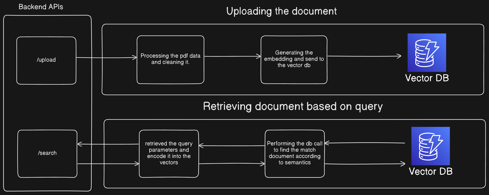

## Semantic Search Assignment: Summer 2024

This repository contains the frontend and backend of the Semantic Search Assignment. The frontend code resides in the `Frontend` folder and Backend code reside on `Backend` folder

This web application is designed to query documents already uploaded to the database (in this case, the Pinecone vector DB). The frontend provides a UI to upload PDFs and a search box to enter your query. Based on the query, it will return the documents that are most relevant.

## Architecture Diagram




## How to run code 

#### Note :
1. For the sake of easy implementation, I have hard-coded the Pinecone API key. 

### Running the application from source code

```bash
# Clone the repository
git clone https://github.com/Gauravkumar2701/semantic-search.git

# Change the directory
cd semantic-search

# Install all the requirements
pip install -r requirements.txt

# Run the fast api server
fastapi dev main.py

# Backend start on the port 8080

# To run frontend
cd Frontend

# install dependency
npm install

# Run the frontend
npm run dev

# Frontend starts on the port 8000
```


### Running the code using the docker.

```bash
# Clone the repository
git clone https://github.com/Gauravkumar2701/semantic-search.git

# Changing the directory to code
cd semantic-search

# Building the docker image
sudo docker-compose up --build

# Frontend run on the port 8080 and backend on port 8000

```


# Document Search API

This API allows you to upload PDF documents, extract their text, generate embeddings, and perform search queries against the uploaded documents.

## Endpoints

### Upload Document

Upload a PDF document to the server, extract its text, and generate an embedding.

- **URL**: `/upload`
- **Method**: `POST`
- **Content-Type**: `multipart/form-data`
- **Request Body**:
  - `file`: PDF file to be uploaded.
- **Responses**:
  - `200 OK`: File uploaded successfully.
    - **Content**:
      ```json
      {
          "message": "File uploaded successfully"
      }
      ```
  - `400 Bad Request`: Error occurred during file upload.
    - **Content**:
      ```json
      {
          "detail": "Error message"
      }
      ```

#### Example Request
```bash
curl -X POST "http://localhost:8000/upload" -F "file=@path/to/your/file.pdf"
```

### Search Documents

**Method:** `GET`

**Parameters:**

- `q` (required, query string): The search query string to find relevant documents. You can use natural language to express your search intent.

**Responses:**

- **200 OK:** Search completed successfully.
    - **Content:** A JSON response containing the search results. The structure of the response might vary depending on your implementation, but it typically includes:
        - `results` (list): A list of dictionaries representing the retrieved documents. Each dictionary could contain fields like:
            - `id` (optional, string): Unique identifier of the document (if applicable in your storage mechanism).
            - `score` (float, optional): Relevance score of the document to the search query (if calculated in your search logic). This score helps prioritize results based on their match to the query.
           

**Example Response (Success):**

```json
{
  "results": [
    {
      "id": "my_document.pdf",
      "score": 0.85, 
      "metadata": {}
    },
    {
      "id": "another_document.pdf",
      "score": 0.72,
      "metadata": {}

    }
  ]
}
```

**Example Request:**
```bash
curl -X POST "http://localhost:8000/search?q={query that we have to do}"
```

## Demo Video
<!-- Watch the demo video [here](images/demo-video.mkv). -->
[](https://youtu.be/YFVzzwwTwfc)