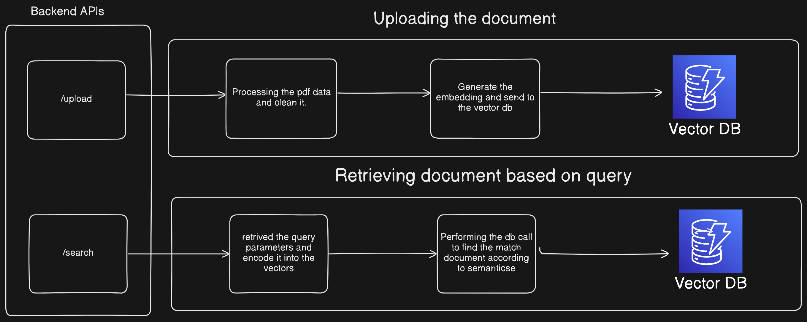

## Semantic Search Assignment: Summer 2024

This repo contain the frontend and backend of Semantic Search Assignment. Frontend code is reside on the frontend folder of and main.py have all the backend code.

This web application is designed to query on the document alread upload on the database(which is in this case is pinecone vector db). The frontend provide you the ui to upload the pdf and a search box to ask you query and based on the query it will give you the document that are mostly related to that.


## Architecture Diagram




## How to run code 

### Running the application from source code

```bash
# Clone the repository
git clone repository-url

# Change the directory
cd semantic-search

# Install all the requirements
pip install -r requirements.txt

# Run the fast api server
fastapi dev main.py

# To run frontend
cd Frontend

# install dependency
npm install

# Run the frontend
npm run dev
```


### Running the code using the docker.

```bash
# Clone the repository
git clone repository-name

# Changing the directory to code
cd semantic-search

# Building the docker image
sudo docker-compose up --build

```


### Using prebuild docker image from docker hub.

```bash
# NOTE :- Here we need configure the network because frontend uses the backend as the host name to make call to the backend so we need make our backend with that name.

# Pull the docker pre-build image from my account
docker pull monster2701/semantic-search-frontend
docker pull monster2701/semantic-search-backend

# Create a container from the frontend image
sudo docker run -it -d -p 8080:8080 --name container-name image-name-frontend

# Create a container from the backend image
sudo docker run -it -d -p 8000:8000 --name container-name image-name-backend

```


# Document Search API

This API allows you to upload PDF documents, extract their text, generate embeddings, and perform search queries against the uploaded documents.

## Endpoints

### Upload Document

Upload a PDF document to the server, extract its text, and generate an embedding.

- **URL**: `/upload`
- **Method**: `POST`
- **Content-Type**: `multipart/form-data`
- **Request Body**:
  - `file`: PDF file to be uploaded.
- **Responses**:
  - `200 OK`: File uploaded successfully.
    - **Content**:
      ```json
      {
          "message": "File uploaded successfully"
      }
      ```
  - `400 Bad Request`: Error occurred during file upload.
    - **Content**:
      ```json
      {
          "detail": "Error message"
      }
      ```

#### Example Request
```bash
curl -X POST "http://localhost:8000/upload" -F "file=@path/to/your/file.pdf"
```

### Search Documents

**Method:** `GET`

**Parameters:**

- `q` (required, query string): The search query string to find relevant documents. You can use natural language to express your search intent.

**Responses:**

- **200 OK:** Search completed successfully.
    - **Content:** A JSON response containing the search results. The structure of the response might vary depending on your implementation, but it typically includes:
        - `results` (list): A list of dictionaries representing the retrieved documents. Each dictionary could contain fields like:
            - `id` (optional, string): Unique identifier of the document (if applicable in your storage mechanism).
            - `score` (float, optional): Relevance score of the document to the search query (if calculated in your search logic). This score helps prioritize results based on their match to the query.
           

**Example Response (Success):**

```json
{
  "results": [
    {
      "filename": "my_document.pdf",
      "score": 0.85,  // Optional relevance score
      "metadata": {}
    },
    {
      "filename": "another_document.pdf",
      "score": 0.72,  // Optional relevance score
    }
  ]
}

```bash
curl -X POST "http://localhost:8000/search?q={query that we have to do}"
```